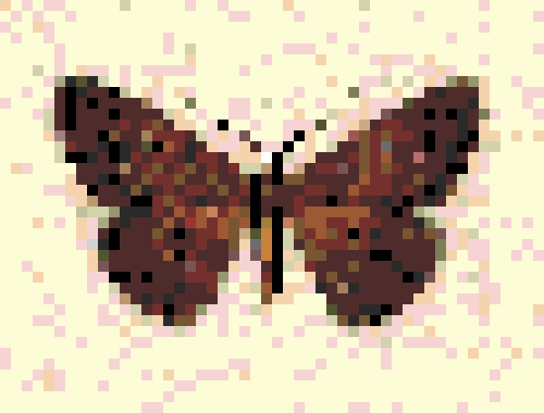

# issa

issa is an image summary string module that produces a small and very compact representation of a source image. Image summaries produced by issa are expected to be a tiny fraction of the source image size at default sampling level (16).

This makes issa image summaries suitable for using as a rich image previews that can be embedded with JSON/HTML payload before actual images are requested. Initial analysis suggested that for a 400Kb image, issa would produce a 3Kb base64 encoded summary, that would take about 2Kb storage space dehydrated. Hydration doesn't take a lot of computational resources and can be done on the critical path. 

Space savings are achieved by two factors:

- issa uses a standard 255 palette and maps all source image colors to that palette. Combined with sampling this is (obviously) the main source of the reduction  
- Additionally, having a standard palette and using GIF image allows issa to remove a reproducible header of the resulting base64 string, that is about 20% of the typical GIF image

## Using issa

Typical workflow of an app using issa has the following steps:

- Summarize, dehydrate and store source images into an image summary
- Dehydrate images as needed and embed into HTML/JSON payload

### Summarizing, dehydrating and storing image summaries

- Load source image
- Convert source image into paletted GIF
- Dehydrate paletted GIF

NOTE: example below oversimplifies error handling for brevity

```go
package main

import (
	"github.com/boggydigital/issa"
	"fmt"
	"image"
	_ "image/jpeg"
	"os"
)

func main() {
	fi, err := os.Open("image.jpeg")
	if err != nil {panic(err)}
	defer fi.Close()

	jpegImage, _, err := image.Decode(fi)
	if err != nil {panic(err)}

	gifImage := issa.GIFImage(
		jpegImage,
		issa.StdPalette(),
		issa.DefaultSampling)

	dhi, err := issa.Dehydrate(gifImage)
	if err != nil {panic(err)}

	fmt.Printf(dhi)
}
```

### Hydrating images

- Load dehydrated string
- Hydrate it

```go
package main

import (
	"github.com/boggydigital/issa"
	"fmt"
)

func main() {

	dhi := ""
	// load dehydrated string into dhi from the store

	hi := issa.Hydrate(dhi)

	fmt.Printf(hi)
}

```

## Sample

Source image (from https://en.wikipedia.org/wiki/Semaeopus):


Magnified GIF version, standard palette, sampling = 8:



Dehydrated image string:
```
50=38=CfWYM2kKC1g9ZWITxo0CBCgQsTRozoECHBhhMzFlxYcWJHigaffdRIkmLJjxhJjsy4kmFJiyolsoTmsCVLkyUhclyoc6BIgj1XKgRKc2BBmhVtuiwo8uVAQABUABh6sOdLiDQVKhTJzgk7rDutkcAGgMTYfNaaNtVYsUrIgSTKmtWJ1OLYu2ZJ5DFYxSJBqkarIlWR1ywAuhxX4V1MYpXAhhUhOoYm8klebGPLuoWJUDHmvEhIIHFC4tljbEsH+yQlOnThslZ56rlMWi+S240pQ3tiEdvjZ3OcjMb9GYBvgcgjrnJtvKwKbHKQwKb5jARN1AIVkxAO7nJczKsUav9chY1s5tC4AeA2/ewatlWUQQuXY1ae4dIf1x4snEc06dGiiRZePdhAw9ptlgknXGHl6adRdd+ZJRyA20mIGTZO1JZXdK6RVhZ8J1H2THFOlIVeaP9hCJprHKKXmRM/vURZPZdhM1xcZoX2WYB3MXcXbI7FNlE+4bEDwJGhRSdHJ0jI4cSFoskh5ZRmYQYIfEWR9Fha0ACCo1n0saGkE3Jggwc2nZDJIYd5AVCFYy5d9CA0i5GG2W1OkqICJ+/NJ5yNcpHmxBOUiScjK8aBpuh2z4DDp2IT3lgYCW7FuFRGzxBWWJmukUDoE3w+s0qGDO5I6WMYpfSQZZN66tpPYzms1qmGcjX20IMcQVPeYrchwc5FSKCWVoWTkvXEYyA69dekciGx1SplmgZNWXnUmpd+WXpEEY1lWZsljDq1OhdWusUUp2LBivbrRXAupOmRmCHVUE90JQWUYwBkKOelWZX4JCDlhnXpwGkxBE2y+/Kbj25vOSXwRieFldVRNQVm8U0Oa3uxUTqhytnHM2kMssgWOQgTuUDlmjHBHFcM0soww6xUzBsrO7O9BI8UEAA7
```

Hydrated image string:
```
data:image/gif;base64,R0lGODlhMgAmAAAAACwAAAAAMgAmAIcqKioqKlQqKn4qKqgqKtIqKvwqVCoqVFQqVH4qVKgqVNIqVPwqfioqflQqfn4qfqgqftIqfvwqqCoqqFQqqH4qqKgqqNIqqPwq0ioq0lQq0n4q0qgq0tIq0vwq/Coq/FQq/H4q/Kgq/NIq/PxUKipUKlRUKn5UKqhUKtJUKvxUVCpUVFRUVH5UVKhUVNJUVPxUfipUflRUfn5UfqhUftJUfvxUqCpUqFRUqH5UqKhUqNJUqPxU0ipU0lRU0n5U0qhU0tJU0vxU/CpU/FRU/H5U/KhU/NJU/Px+Kip+KlR+Kn5+Kqh+KtJ+Kvx+VCp+VFR+VH5+VKh+VNJ+VPx+fip+flR+fn5+fqh+ftJ+fvx+qCp+qFR+qH5+qKh+qNJ+qPx+0ip+0lR+0n5+0qh+0tJ+0vx+/Cp+/FR+/H5+/Kh+/NJ+/PyoKiqoKlSoKn6oKqioKtKoKvyoVCqoVFSoVH6oVKioVNKoVPyofiqoflSofn6ofqioftKofvyoqCqoqFSoqH6oqKioqNKoqPyo0iqo0lSo0n6o0qio0tKo0vyo/Cqo/FSo/H6o/Kio/NKo/PzSKirSKlTSKn7SKqjSKtLSKvzSVCrSVFTSVH7SVKjSVNLSVPzSfirSflTSfn7SfqjSftLSfvzSqCrSqFTSqH7SqKjSqNLSqPzS0irS0lTS0n7S0qjS0tLS0vzS/CrS/FTS/H7S/KjS/NLS/Pz8Kir8KlT8Kn78Kqj8KtL8Kvz8VCr8VFT8VH78VKj8VNL8VPz8fir8flT8fn78fqj8ftL8fvz8qCr8qFT8qH78qKj8qNL8qPz80ir80lT80n780qj80tL80vz8/Cr8/FT8/H78/Kj8/NL8/PwAAAAAAP8A/wAA////AAD/AP///wD///9sbGxsbJZsbMBslmxslpZslsBswGxswJZswMCWbGyWbJaWbMCWlmyWlpaWlsCWwGyWwJaWwMDAbGzAbJbAbMDAlmzAlpbAlsDAwGzAwJbAwMAAAAAAAAAAAAAAAAAAAAAI/wCfWYM2kKC1g9ZWITxo0CBCgQsTRozoECHBhhMzFlxYcWJHigaffdRIkmLJjxhJjsy4kmFJiyolsoTmsCVLkyUhclyoc6BIgj1XKgRKc2BBmhVtuiwo8uVAQABUABh6sOdLiDQVKhTJzgk7rDutkcAGgMTYfNaaNtVYsUrIgSTKmtWJ1OLYu2ZJ5DFYxSJBqkarIlWR1ywAuhxX4V1MYpXAhhUhOoYm8klebGPLuoWJUDHmvEhIIHFC4tljbEsH+yQlOnThslZ56rlMWi+S240pQ3tiEdvjZ3OcjMb9GYBvgcgjrnJtvKwKbHKQwKb5jARN1AIVkxAO7nJczKsUav9chY1s5tC4AeA2/ewatlWUQQuXY1ae4dIf1x4snEc06dGiiRZePdhAw9ptlgknXGHl6adRdd+ZJRyA20mIGTZO1JZXdK6RVhZ8J1H2THFOlIVeaP9hCJprHKKXmRM/vURZPZdhM1xcZoX2WYB3MXcXbI7FNlE+4bEDwJGhRSdHJ0jI4cSFoskh5ZRmYQYIfEWR9Fha0ACCo1n0saGkE3Jggwc2nZDJIYd5AVCFYy5d9CA0i5GG2W1OkqICJ+/NJ5yNcpHmxBOUiScjK8aBpuh2z4DDp2IT3lgYCW7FuFRGzxBWWJmukUDoE3w+s0qGDO5I6WMYpfSQZZN66tpPYzms1qmGcjX20IMcQVPeYrchwc5FSKCWVoWTkvXEYyA69dekciGx1SplmgZNWXnUmpd+WXpEEY1lWZsljDq1OhdWusUUp2LBivbrRXAupOmRmCHVUE90JQWUYwBkKOelWZX4JCDlhnXpwGkxBE2y+/Kbj25vOSXwRieFldVRNQVm8U0Oa3uxUTqhytnHM2kMssgWOQgTuUDlmjHBHFcM0soww6xUzBsrO7O9BI8UEAA7
```